# EVEREST_NF — Pipeline Metro Map

A hand-drawn conceptual "metro map" of the `everest_nf` viral-metagenomics pipeline.
Each coloured **line** is a phase/modality; white circles (◍) are **interchanges**
where flows merge. Source: [`everest_metro_map.mmd`](everest_metro_map.mmd) ·
Rendered: [`everest_metro_map.svg`](everest_metro_map.svg).

```mermaid
flowchart LR
    classDef sr    fill:#1f77b4,color:#fff,stroke:#0d3c61,stroke-width:2px;
    classDef lr    fill:#2ca02c,color:#fff,stroke:#145214,stroke-width:2px;
    classDef ct    fill:#ff7f0e,color:#fff,stroke:#7a3c00,stroke-width:2px;
    classDef clean fill:#9467bd,color:#fff,stroke:#4b2d63,stroke-width:2px;
    classDef tax   fill:#d62728,color:#fff,stroke:#6e1414,stroke-width:2px;
    classDef rep   fill:#555,color:#fff,stroke:#222,stroke-width:2px;
    classDef hub   fill:#fff,color:#000,stroke:#000,stroke-width:4px;
    classDef term  fill:#111,color:#fff,stroke:#000,stroke-width:2px;
    classDef opt   fill:#e6e6e6,color:#333,stroke:#999,stroke-width:1px,stroke-dasharray:5 4;

    START([Samplesheet]):::term
    START -->|short reads| TR[Trim adaptors<br/>Trimmomatic]:::sr
    TR --> PX[Remove PhiX<br/>BBMap]:::sr
    PX --> HRS[Host removal<br/>Kallisto + Minimap2]:::sr
    HRS --> DD[Dedupe + Normalize<br/>BBMap]:::sr
    DD --> MG[Merge pairs<br/>BBMap]:::sr
    MG --> SP[De novo assembly<br/>metaSPAdes]:::sr
    SP --> DR[Dereplicate contigs<br/>MMseqs2 linclust]:::sr
    DR -.-> VR[vRhyme binning<br/>optional siding]:::opt
    DR --> POOL
    START -.->|QC| FQ[FastQC]:::rep
    START -->|long reads| TRL[Trim + filter<br/>long reads]:::lr
    TRL --> HRL[Host removal<br/>Minimap2 + SAMtools]:::lr
    HRL --> POOL
    START -->|pre-assembled| CIN[Input contigs]:::ct
    CIN --> POOL
    POOL((Contig Pool)):::hub
    POOL --> SK[Length filter<br/>SeqKit]:::clean
    SK --> CV[Viral verification<br/>CheckV]:::clean
    CV -.-> ANN[Annotation siding<br/>Pharokka / VirSorter2 / ABRicate / BACPHLIP]:::opt
    CV --> VC((Viral Contigs)):::hub
    POOL --> MAP[Map reads to contigs<br/>BBMap]:::clean
    MAP --> BP[Coverage / RPKM<br/>BBMap process]:::clean
    VC --> TX[Taxonomy NT + AA<br/>MMseqs2 easy-taxonomy]:::tax
    TX --> TK[Reformat lineage<br/>TaxonKit]:::tax
    TK --> SPS[Per-sample summary<br/>R]:::tax
    SPS --> SC[Cohort summary<br/>R]:::tax
    SC --> MS((Merge summary<br/>+ coverage)):::hub
    BP --> MS
    MS --> UR[Update taxonomic rank]:::tax
    UR --> CO[Combine<br/>EVEREST summaries]:::tax
    CO --> OUT([EVEREST nt + aa summaries]):::term
    FQ --> MQ[MultiQC report]:::rep
    CO -.versions.-> MQ
    MQ --> ROUT([MultiQC]):::term
```





## Legend

| Line | Phase |
|------|-------|
| 🔵 blue | Short-read preprocessing → assembly |
| 🟢 green | Long-read preprocessing |
| 🟠 orange | Pre-assembled contig input |
| 🟣 purple | Contig cleaning & annotation |
| 🔴 red | Taxonomy & summary |
| ⚫ grey | Reporting (FastQC / MultiQC) |

- **Solid** edge = data flow; **dashed** = optional / dead-end siding or versions-QC feed.
- **◍ interchanges** — where lines merge: **Contig Pool** (assembly + long-read + raw
  contigs converge), **Viral Contigs** (CheckV output → taxonomy), **Merge summary**
  (taxonomy meets coverage stats).

## Fidelity notes (known gaps vs. the code, to resolve)

1. **Long-read branch is partial.** Long reads are trimmed + host-removed in code
   (`LONGREAD_HOSTREMOVAL`), but the hand-off into the assembly / Contig Pool is the
   *intended* convergence and is not fully wired yet. → **finalize the long-read branch.**
2. **Annotation tools are side-products.** Pharokka / VirSorter2 / ABRicate / BACPHLIP run
   off CheckV but do not feed the taxonomy trunk; shown as a dashed siding.
3. **Taxonomy trunk** should be confirmed complete end-to-end:
   CheckV → MMseqs2 (NT+AA) → TaxonKit → per-sample summary → cohort summary →
   merge-with-coverage → update rank → combine → EVEREST summaries.

## Next step — reconcile with the generated DAG

This map is conceptual. On the next pipeline run, emit Nextflow's own DAG and merge it
with this design so node/edge labels match the real process + channel names:

```bash
nextflow run ... -with-dag flowchart.mmd      # Nextflow emits a Mermaid DAG
```

Then merge the auto-generated DAG (accurate process/file-name patterns) with this
hand-drawn metro map (readable phase/line structure) into the finalized diagram.
